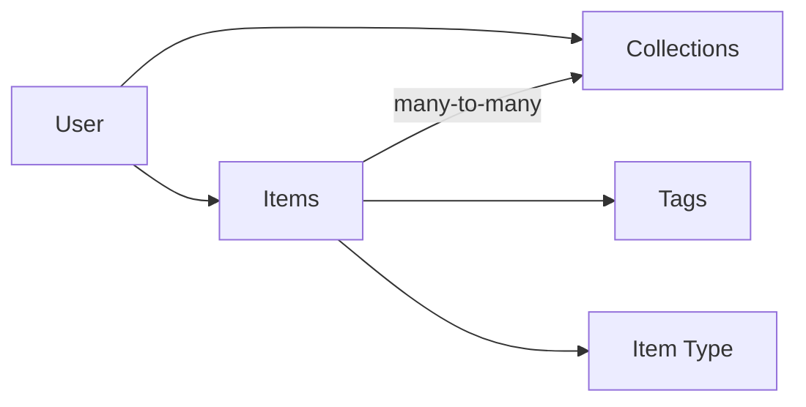
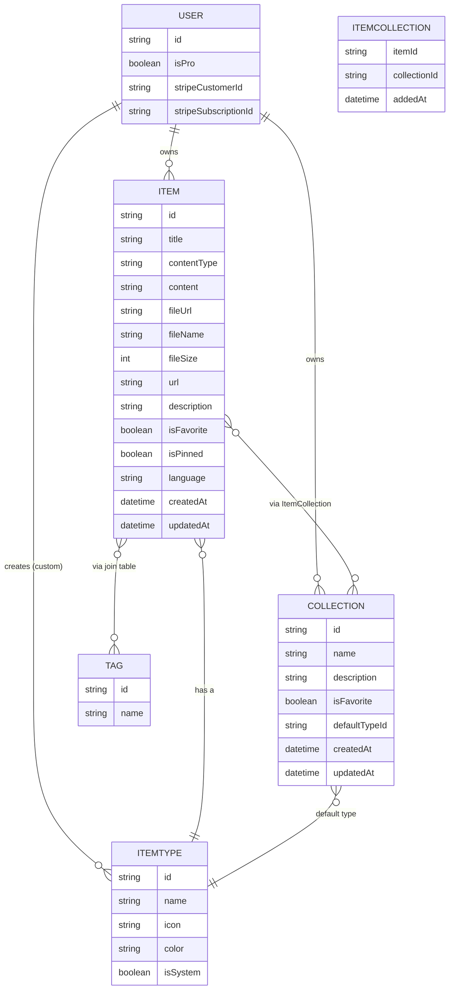

# Silo — Project Overview

## Problem

Developers keep their essentials scattered across tools:

- Code snippets in VS Code or Notion
- AI prompts in chat history
- Context files buried in projects
- Useful links in bookmarks
- Docs in random folders
- Commands in `.txt` files
- Project templates in GitHub gists
- Terminal commands in bash history

This causes constant context switching, lost knowledge, and inconsistent workflows.

**Silo** is one fast, searchable, AI-enhanced hub for all dev knowledge and resources.

## Target Users

| User | Need |
|---|---|
| Everyday Developer | Fast capture/retrieval of snippets, prompts, commands, links |
| AI-first Developer | Saves prompts, contexts, workflows, system messages |
| Content Creator / Educator | Stores code blocks, explanations, course notes |
| Full-stack Builder | Collects patterns, boilerplates, API examples |

## Core Concepts



An **Item** is the atomic unit of content. A **Collection** is a named grouping of items. Items can belong to multiple collections (e.g. a React snippet can live in both "React Patterns" and "Interview Prep").

## Features

### A. Items & Item Types

System item types (fixed, cannot be edited/deleted by users):

| Type | Content Kind | Tier |
|---|---|---|
| `snippet` | text | Free |
| `prompt` | text | Free |
| `note` | text | Free |
| `command` | text | Free |
| `link` | url | Free |
| `file` | file | Pro |
| `image` | file | Pro |

Users can later define **custom types** (post-MVP, Pro feature).

Items should be quick to create/access via a **drawer** UI (not a full page navigation). Item detail routes follow the pattern `/items/[type]`, e.g. `/items/snippets`.

### B. Collections

- Any item type can belong to a collection.
- An item can belong to **multiple** collections via a join table.
- Examples: "React Patterns" (snippets, notes), "Context Files" (files), "Python Snippets" (snippets).

### C. Search

Full search across:
- Content
- Tags
- Titles
- Types

### D. Authentication

- Email/password
- GitHub OAuth
- via **NextAuth v5**

### E. Other Features

- Favorite items/collections
- Pin items to top
- Recently used items
- Import code from a file
- Markdown editor for text-based types
- File upload for `file`/`image` types
- Export data (multiple formats)
- Dark mode (default), light mode optional
- Add/remove item to/from multiple collections
- View which collections an item belongs to

### F. AI Features (Pro only)

- AI auto-tag suggestions
- AI summaries
- AI "Explain This Code"
- AI prompt optimizer

## Data Model

Rough draft — subject to change as implementation proceeds.



### Draft Prisma Schema

```prisma
// This is a rough draft for planning purposes only.
// Actual schema will be introduced via migrations — never `db push`.

model User {
  id                   String   @id @default(cuid())
  // ...NextAuth fields (name, email, image, accounts, sessions)
  isPro                Boolean  @default(false)
  stripeCustomerId     String?
  stripeSubscriptionId String?

  items       Item[]
  collections Collection[]
  itemTypes   ItemType[] // custom types only; null user = system type

  createdAt DateTime @default(now())
  updatedAt DateTime @updatedAt
}

model Item {
  id          String   @id @default(cuid())
  title       String
  contentType String   // "text" | "file"
  content     String?  // text content, null if file
  fileUrl     String?  // R2 URL, null if text
  fileName    String?
  fileSize    Int?
  url         String?  // for link type
  description String?
  isFavorite  Boolean  @default(false)
  isPinned    Boolean  @default(false)
  language    String?  // optional, for code snippets

  user       User         @relation(fields: [userId], references: [id])
  userId     String
  itemType   ItemType     @relation(fields: [itemTypeId], references: [id])
  itemTypeId String
  tags       Tag[]
  collections ItemCollection[]

  createdAt DateTime @default(now())
  updatedAt DateTime @updatedAt
}

model ItemType {
  id       String  @id @default(cuid())
  name     String
  icon     String
  color    String
  isSystem Boolean @default(false)

  user   User?   @relation(fields: [userId], references: [id])
  userId String? // null for system types

  items Item[]
}

model Collection {
  id            String  @id @default(cuid())
  name          String
  description   String?
  isFavorite    Boolean @default(false)
  defaultTypeId String?

  user   User   @relation(fields: [userId], references: [id])
  userId String

  items ItemCollection[]

  createdAt DateTime @default(now())
  updatedAt DateTime @updatedAt
}

model ItemCollection {
  item         Item       @relation(fields: [itemId], references: [id])
  itemId       String
  collection   Collection @relation(fields: [collectionId], references: [id])
  collectionId String
  addedAt      DateTime   @default(now())

  @@id([itemId, collectionId])
}

model Tag {
  id    String @id @default(cuid())
  name  String
  items Item[]
}
```

## Tech Stack

| Layer | Choice |
|---|---|
| Framework | [Next.js 16](https://nextjs.org/docs) / [React 19](https://react.dev) — SSR pages with dynamic components, API routes for backend needs (items, file uploads, AI calls). Single repo/codebase. |
| Language | TypeScript |
| Database | [Neon](https://neon.tech) (PostgreSQL, serverless) |
| ORM | [Prisma](https://www.prisma.io/docs) 7 (latest) |
| Cache | Redis (maybe, TBD) |
| File storage | [Cloudflare R2](https://developers.cloudflare.com/r2/) |
| Auth | [NextAuth v5](https://authjs.dev) — Email/password + GitHub OAuth |
| AI | OpenAI `gpt-5-nano` |
| Styling | Tailwind CSS v4 + [shadcn/ui](https://ui.shadcn.com) |

> **IMPORTANT:** Never use `prisma db push` or otherwise directly mutate the DB schema. All schema changes go through migrations, run in dev then promoted to prod.

## Monetization

Freemium model.

**Free**
- 50 items total
- 3 collections
- All system types except files/images
- Basic search
- No file/image uploads
- No AI features

**Pro — $8/mo or $72/yr**
- Unlimited items
- Unlimited collections
- File & image uploads
- Custom types (later)
- AI auto-tagging
- AI code explanation
- AI prompt optimizer
- Export data (JSON/ZIP)
- Priority support

> During development, the Pro/Free gate is stubbed out — all users get full access. Build the plumbing (`isPro`, Stripe fields) now so gating is a later toggle, not a rewrite.

## UI/UX

### General
- Modern, minimal, developer-focused
- Dark mode by default; light mode optional
- Clean typography, generous whitespace
- Subtle borders/shadows
- Reference points: [Notion](https://notion.so), [Linear](https://linear.app), [Raycast](https://raycast.com)
- Syntax highlighting for code blocks

### Layout
- Sidebar (collapsible) + main content
  - Sidebar: item types with links to filtered views (Snippets, Commands, etc.), latest collections
  - Main: grid of collection cards, color-coded by the item type they hold the most of; items nested under collections, color-coded by border
- Individual items open in a quick-access drawer, not a full page

### Type Colors & Icons

| Type | Color | Hex | Icon ([lucide](https://lucide.dev)) |
|---|---|---|---|
| Snippet | 🔵 Blue | `#3b82f6` | `Code` |
| Prompt | 🟣 Purple | `#8b5cf6` | `Sparkles` |
| Command | 🟠 Orange | `#f97316` | `Terminal` |
| Note | 🟡 Yellow | `#fde047` | `StickyNote` |
| File | ⚪ Gray | `#6b7280` | `File` |
| Image | 🩷 Pink | `#ec4899` | `Image` |
| Link | 🟢 Emerald | `#10b981` | `Link` |

### Responsive
- Desktop-first, mobile-usable
- Sidebar collapses into a drawer on mobile

### Micro-interactions
- Smooth transitions
- Hover states on cards
- Toast notifications for actions
- Loading skeletons
